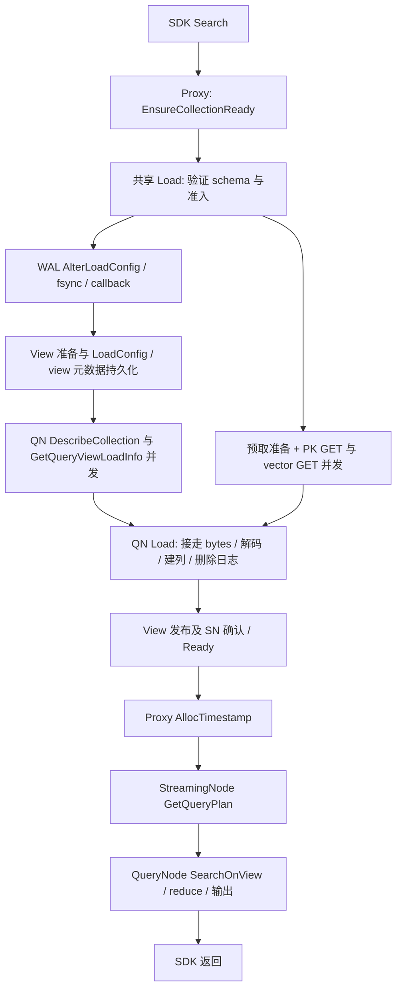

# Milvus 自动冷加载搜索：优化、延迟、访问拓扑与复现报告

实验日期：2026-10-09—10，整理日期：2026-10-10。源码基线为 `sunby/milvus` 的 `codex/load-1m-segments-pr-stack-rebased-qv-work`，提交 `2dd24a2189a11c7f61652eb5a4b1c17921348325`。本报告对应最终 v83；最初误用的 `master-ack-callback-registration` 分支不参与这里的结论。

## 1. 结论与适用范围

在本机、1000 × 768 float32、一个 sealed segment、一次搜索的条件下，**Release 后触发自动 Load 的 SDK 搜索均值从 33.495 / 35.572 ms 降到 9.559 / 9.811 ms**，分别是只返回 ID、返回 ID + vector。最终两场景各三次，共六次，全部小于 10 ms。前台 MinIO 从 **6 GET、4 个依赖阶段**降到 **2 GET、1 个实际并发阶段**。两个 GET 还与 WAL 持久化发生了实际重叠。

| 场景 | 原始 NVMe 基线 | v83 三次完整样本，ms | v83 均值 | v83 最大值 | 累计均值降幅 |
|---|---:|---|---:|---:|---:|
| ID：`output_fields=[]` | 33.495457 | 9.691247 / 9.608509 / 9.378333 | 9.559363 | 9.691247 | 71.46% |
| ID + vector：`output_fields=['vector']` | 35.572190 | 9.954684 / 9.836449 / 9.640484 | 9.810539 | 9.954684 | 72.42% |

原始基线只有每场景一次，最终每场景三次；中间还有代码和部署配置的累计变化。因此，这是**这组固定实验的前后结果**，不能把累计差额全部归因于某一个优化，也不能把各阶段的减少量相加。

以下限制必须和数字一起读：

- “冷”是 QueryNode 的 segment 释放后重新加载。每次都观测到 Go Load = 1、native Load = 1、重新从 MinIO 获取原始数据。没有清空 MinIO/OS 页缓存，也没有清空不可变 manifest 元数据缓存。
- 服务启动首搜另列：最终 v83 为 **18.078275 ms**。10 ms 结果不涵盖冷进程启动。
- 六次全部小于 10 ms 不代表 P99、生产 SLA 或下一次一定小于 10 ms。此前 20.614160 ms、14.973801 ms、10.204165 ms 等样本全部保留。
- 最后实施的“两条常驻预取线程”验证了线程存活和实际并发；**未证实显著均值收益**。不能把过去的长尾根因断定为线程创建。
- 只测这两个输出场景。表里仍有五个标量字段，但最终搜索不返回它们。没有用热搜、显式提前 Load、计时前读对象来凑 10 ms。
- 未评估大 segment、百万 segment、多 shard、多 replica、高并发吞吐、远程对象存储，以及全机缓存清空后的性能。实验 profile 不应直接当作生产默认配置。

过程记录见 [WORKLOG.zh-CN.md](WORKLOG.zh-CN.md)。逐次记录、阶段数据、对照和失败样本见 [证据索引](evidence/README.md)。

## 2. 数据、部署与计时口径

### 2.1 数据与请求

| 项目 | 固定值 |
|---|---|
| 集合 | `cold_search_qv_768`，1 shard，1000 行 |
| 主键 | `id`，INT64，0…999 |
| 向量 | FLOAT_VECTOR，dim = 768，随机种子 20261009，按行归一化 |
| 标量 | `age` INT64；`score` DOUBLE；`active` BOOL；`tag` VARCHAR(64)；`payload` JSON |
| 请求 | nq = 1，topK = 10，COSINE，Strong，查询向量为第 123 行 |
| 索引实际状态 | FLAT / NO_TRAIN；1000 < 默认建索引门槛 1024，存在完成状态的索引元数据，但没有实际索引文件 |
| 实际计算 | 原始向量 brute force，trace 为 `knowhere bf search with buf` |
| 正确答案 ID | 123, 660, 322, 541, 913, 593, 694, 56, 947, 348 |
| 向量返回检查 | 10 × 768 个 float32 与插入数据逐值一致 |

数据准备时调用一次 `Collection.flush()` 以形成可反复释放的 sealed 数据；创建索引元数据。这些在计时之外。**每一次正式搜索流程没有 Collection.flush，也没有手动 LoadCollection。**

最终 manifest 为显式版本 2，包含三个列组：系统列/PK、标量、向量。只返回 ID 也必须读取向量以算距离；返回向量复用已加载的数据，所以两个场景的对象访问数相同。

### 2.2 本机运行条件

ARM64 Linux，Go 1.26.6，GCC 12，Rust 1.92 系列；本地编译 Go、C++、Rust。Knowhere 基线为 `16e873b1`，milvus-storage 基线为 `e6e1ab0817ab85a140f37ba7c920a5e6ebba0d71`。精确依赖补丁见 [manifest.json](../../../tools/cold_search/dependencies/manifest.json)。

- Milvus standalone：CPU 0–4，`GOMAXPROCS=2`，`GOGC=200`，显式 `MEM_LIMIT=66206023680`。
- MinIO：`milvusdb/minio:RELEASE.2024-12-18T13-15-44Z`，host 网络，127.0.0.1:9000，CPU 5–6，Go 并发度 2。
- etcd：`quay.io/coreos/etcd:v3.5.25`，host 网络，127.0.0.1:2379，CPU 7，Go 并发度 1。
- 数据、etcd、MinIO 在本地 NVMe。WAL 是同一 NVMe 上的 2 GiB ext4 loop 文件系统，以避开父文件系统使用率超过 Woodpecker 80% 水位；loop direct IO 打开，**fsync 保留**。
- jemalloc：`background_thread:true,narenas:1,dirty_decay_ms:600000,muzzy_decay_ms:600000,thp:always`。
- 正常 QueryView lease = 60 s；正式轮次 Release 后等待 62 s，另有 0–0.3 s 确定种子抖动，避免始终撞上固定周期任务。
- trace 100% 采样。计时期间没有并行编译、测试、哈希扫描或人工 `/metrics` 抓取。

部署变更包括磁盘、网络、CPU、线程池、内存预算和分配器，因此整体收益不是纯源码收益。源代码与配置有意分开提交。

### 2.3 一轮如何测

1. 如集合已 Loaded，Release；检查状态为 NotLoad。
2. 等待 62 s + 抖动，让 lease 保护下的旧 segment 真正退出。
3. 记录请求标签，抓取 metrics before，读取可选进程缺页计数。
4. 用 `perf_counter_ns()` 计时 `query.tolist()` + SDK `Collection.search()`，包含 SDK 编码、RPC、自动 Load、查询执行和返回解码。
5. SDK 返回即停止计时。随后用 NumPy 全量 cosine 独立算 topK、核对 ID/距离，向量场景逐值检查 float32；ID 场景检查没有偷偷返回标量/向量。
6. 抓取 metrics after，检查 Loaded；让 trace exporter 排空 6 s。
7. 从 sum/count 差分检查真实加载次数，从 MinIO 原始时间戳核对 GET 数量与重叠。不能只凭 NotLoad 或低延迟宣布“冷搜”。

短周期筛选曾用 lease 0 / wait 0.1 s，专门标作 screening。它们用于开关、旧库、新库的相邻比较，**不能替代正常 lease 的确认实验**。跨过程首搜也单独标记。

## 3. 各阶段前后对比

只有以下三个互斥区间能直接相加：`Ready 等待 + Ready 后 execution + SDK/RPC 其余`。最后一项是 SDK 总耗时减服务端主请求分区，不是“纯网络时间”。WAL、QN Load、native Load 等是嵌套阶段，Parquet/chunk 是多个并行或顺序批次的累计值，不能再加回总耗时。

| 阶段，ms | ID 原始 | ID v83 | vector 原始 | vector v83 |
|---|---:|---:|---:|---:|
| SDK 总耗时 | 33.495457 | 9.559363 | 35.572190 | 9.810539 |
| 自动加载至 Ready | 20.293884 | 6.024209 | 22.182579 | 6.062212 |
| Ready 后 execution | 11.706605 | 2.079966 | 11.827519 | 2.237138 |
| SDK/RPC 其余 | 1.494968 | 1.455187 | 1.562092 | 1.511189 |
| WAL broadcast（嵌套） | 10.242584 | 2.228261 | 12.447823 | 2.447694 |
| WAL append 含同步落盘（嵌套） | 7.784413 | 0.576780 | 9.809752 | 0.571064 |
| WAL callback（嵌套） | 0.738176 | 0.372733 | 0.754685 | 0.349692 |
| Coord view Load 等待（嵌套） | 9.399475 | 3.265051 | 9.209022 | 3.254219 |
| Coord view 元数据保存累计 | 0.747532 | 0.546665 | 0.643218 | 0.533313 |
| QN segment Load | 6.955118 | 1.639053 | 6.861541 | 1.597101 |
| 资源预留 | 0.408396 | 0.158423 | 0.415430 | 0.150384 |
| 创建 segment | 0.409748 | 0.175512 | 0.414562 | 0.177467 |
| native Load | 3.942584 | 0.923316 | 3.919606 | 0.900363 |
| delta logs | 0.178950 | 0.047037 | 0.159851 | 0.047976 |
| Parquet read/decode 批次累计 | 6.201204 | 0.625768 | 5.920372 | 0.605861 |
| chunk build 批次累计 | 2.429738 | 0.054901 | 2.417887 | 0.050206 |
| Search 中 vector prefetch 等待 | 7.430160 | 0.004038 | 7.178708 | 0.007787 |
| 向量距离计算 | 0.370380 | 0.325001 | 0.329872 | 0.316226 |
| GetQueryPlan RPC 累计 | 0.599621 | 0.205153 | 0.542596 | 0.208064 |
| SearchOnView RPC | 9.204948 | 1.299927 | 9.062762 | 1.456633 |
| QueryOnView RPC | 0.880429 | 0.000000 | 1.171928 | 0.000000 |
| PK fill | 0.169568 | 0.020757 | 0.188420 | 0.018861 |
| 归并前准备（含 PK） | 0.228303 | 0.065076 | 0.262410 | 0.059241 |
| 归并后字段回填 | 0.000000 | 0.085118 | 0.000000 | 0.132921 |
| QN reduce 整体 | 0.382213 | 0.301807 | 0.427920 | 0.403411 |
| SN recovery 元数据保存 | 未埋点 | 0.248829 | 未埋点 | 0.277661 |

旧版本的 StreamingNode catalog 指标显示为缺失：v74 才加这个探针，不能把历史报表里的 0 当成“没有持久化”。原生 `ManifestReaderOpen`、`ManifestTranslator`、`ManifestCacheSlot`、`ManifestGroupWait` 四个探针在基线文档中有记载，但没有对应生产调用点；未用它们声称零耗时或完整分解，相关冲突未在本次交付中擅自修正。

### 3.1 历次正式确认结果

| 版本 | 每场景 n | ID 均值 / 最大，ms | vector 均值 / 最大，ms | 六次全部 <10 ms |
|---|---:|---:|---:|---|
| 原始 NVMe | 1 | 33.495457 / 33.495457 | 35.572190 / 35.572190 | 否 |
| v28 | 3 | 14.155954 / 14.228072 | 14.741890 / 14.915642 | 否 |
| v41 | 3 | 13.274345 / 13.432719 | 13.902495 / 15.130270 | 否 |
| v45 | 3 | 12.473029 / 13.786024 | 13.554026 / 14.283611 | 否 |
| v49 | 3 | 12.009415 / 12.963169 | 12.212438 / 12.608165 | 否 |
| v57 | 3 | 11.695200 / 12.509459 | 10.966598 / 11.124561 | 否 |
| v64 | 3 | 9.848825 / 10.251394 | 10.122087 / 10.395277 | 否 |
| v70 | 3 | 9.851744 / 10.381176 | 9.818669 / 9.976608 | 否 |
| v73 | 3 | 9.771481 / 10.392536 | 11.387437 / 14.973801 | 否 |
| v80 | 3 | 9.515349 / 9.668970 | 9.914880 / 10.204165 | 否 |
| v83 | 3 | 9.559363 / 9.691247 | 9.810539 / 9.954684 | 是 |

完整阶段矩阵保存在 [formal-phase-comparison.csv](evidence/formal-phase-comparison.csv)，逐条数值在 [formal-stages.json](evidence/formal-stages.json)。中间版本的异常没有被平均表隐藏：例如 v73 向量均值被 14.973801 ms 那次抬高。

### 3.2 真正剩下的成本

v83 大约是 Ready 6.0 ms、执行 2.1–2.2 ms、SDK/RPC 其余 1.45–1.51 ms；纯距离计算仅 0.32 ms。最初最大问题是控制面排队/持久化、对象读取依赖链和数据搬运，不是 1000 × 768 的算距本身。

现在剩余成本分布在 WAL 广播、view 准备/发布/确认、QN 加载、前台 RPC、结果准备和 SDK。继续压低均值应先证明可以消除哪个依赖或哪段数据转换，而不是从 0.3 ms 的 BF 里寻找数毫秒空间。10 ms 边界也已经接近普通调度/IO 波动；需要更大样本先查长尾。

### 3.3 Go / native Load 的全部已完成阶段

以下再展开一次加载的 17 个 Go 阶段、14 个 native 阶段及其 total。Go 阶段有父子嵌套，不能将 17 行相加；native 的 14 个互斥阶段与其 total 核对过求和。每个最终样本各项 count 都为 1、result 为 success。单位 ms，原始每场景一次，v83 每场景三次取均值。

| Go stage | ID 原始 | ID v83 | vector 原始 | vector v83 |
|---|---:|---:|---:|---:|
| `csegment_load` | 4.166485 | 1.081975 | 4.150276 | 1.048438 |
| `delta_logs` | 0.178950 | 0.047037 | 0.159851 | 0.047976 |
| `load_pool_queue` | 0.008834 | 0.011040 | 0.009271 | 0.011553 |
| `load_segment` | 4.371319 | 1.219698 | 4.352857 | 1.165704 |
| `local_segment_load` | 4.327378 | 1.143954 | 4.301177 | 1.106892 |
| `new_segment` | 0.409748 | 0.175512 | 0.414562 | 0.177467 |
| `on_loaded` | 0.013041 | 0.007458 | 0.013514 | 0.021268 |
| `physical_load` | 6.508360 | 1.445626 | 6.406288 | 1.394320 |
| `pk_candidate` | 1.546662 | 0.001906 | 1.477389 | 0.001761 |
| `release_resource` | 0.002357 | 0.004297 | 0.002326 | 0.004319 |
| `reserve_resource` | 0.408396 | 0.158423 | 0.415430 | 0.150384 |
| `sealed_load` | 4.357612 | 1.214560 | 4.340565 | 1.160620 |
| `sealed_post_load` | 0.005348 | 0.003155 | 0.015180 | 0.003379 |
| `sealed_prepare` | 0.001180 | 0.001358 | 0.001024 | 0.001690 |
| `sync_json_stats` | 0.160312 | 0.061371 | 0.150205 | 0.057837 |
| `total` | 6.955118 | 1.639053 | 6.861541 | 1.597101 |
| `update_index_meta` | 0.016219 | 0.017083 | 0.017055 | 0.020421 |

| native stage | ID 原始 | ID v83 | vector 原始 | vector v83 |
|---|---:|---:|---:|---:|
| `clone_state` | 0.018499 | 0.012826 | 0.019943 | 0.011672 |
| `column_groups` | 3.662033 | 0.722542 | 3.626771 | 0.706228 |
| `create_text_indexes` | 0.000203 | 0.000216 | 0.000199 | 0.000152 |
| `default_fields` | 0.000221 | 0.000194 | 0.000363 | 0.000244 |
| `field_data` | 0.000369 | 0.000217 | 0.000175 | 0.000213 |
| `finalize` | 0.003089 | 0.002973 | 0.004290 | 0.004936 |
| `indexes` | 0.000680 | 0.000468 | 0.000731 | 0.000519 |
| `json_stats` | 0.064080 | 0.043961 | 0.077868 | 0.043459 |
| `lock_wait` | 0.001351 | 0.000549 | 0.001188 | 0.000603 |
| `prepare` | 0.166360 | 0.122256 | 0.160749 | 0.115557 |
| `publish` | 0.023822 | 0.015842 | 0.024583 | 0.015604 |
| `reload_columns` | 0.000066 | 0.000071 | 0.000100 | 0.000077 |
| `text_indexes` | 0.000154 | 0.000122 | 0.000128 | 0.000132 |
| `text_lob` | 0.001657 | 0.001078 | 0.002518 | 0.000968 |
| `total` | 3.942584 | 0.923316 | 3.919606 | 0.900363 |

这仍不等于所有控制面生命周期都有完整探针：Coord view_load 的若干细分生命周期记录曾出现 `incomplete_order`，使用可确认的 total、现有 flush/sync 与 trace 解释，没有补造缺失阶段。

## 4. MinIO 次数、访问拓扑与实际并发

### 4.1 存储访问按依赖计算

**基线：6 GET / 4 步，分组 [3,1,1,1]。** 三个列组 footer 并发，然后 PK 数据，再 Bloom filter，再搜索需要的向量数据。

**最终：2 GET / 1 步，分组 [2]。** PK/系统列整个 Parquet 6191 B 与向量整个 Parquet 3073941 B 并发，合计 3080132 B。返回 ID 或 ID + vector 都一样。标量组不打开，Bloom filter 不读取；manifest 带 file/footer size，正常这两次 raw 读取没有额外 HEAD。

这是 Release 后、元数据已热的计数。manifest 也冷的启动实验出现额外 HEAD + GET，共四次 S3，不能外推“任何第一次搜索都只有两次”。某些历史窗口还出现后台 ListObjectsV2，已分开记录；最终六次窗口没有额外 S3。

### 4.2 六次真正重叠了多少

判断并发使用对象请求的实际 `[start, end]`，不是线程池大小、总耗时相加或代码里出现 goroutine。下面列出两个 GET 的共同重叠区间长度。

| 场景 / 轮次 | GET 数 | 两 GET 重叠，ms | 与 WAL broadcast 重叠（PK / vector），ms |
|---|---:|---:|---|
| id-only / 0 | 2 | 0.531982 | 0.543509 / 1.169470 |
| with-vector / 0 | 2 | 0.502116 | 0.502116 / 1.539416 |
| id-only / 1 | 2 | 0.496117 | 0.496117 / 1.487856 |
| with-vector / 1 | 2 | 0.552699 | 0.552699 / 1.751127 |
| id-only / 2 | 2 | 0.551792 | 0.551792 / 1.390551 |
| with-vector / 2 | 2 | 0.489770 | 0.489780 / 1.387291 |

以 `nvme-v83-confirm-id-only-0` 为例，相对于该次请求记录的起点：

| 动作 | 开始，ms | 结束，ms |
|---|---:|---:|
| EnsureCollectionReady RPC | 1.189403 | 7.082467 |
| WAL broadcast | 1.638996 | 3.695358 |
| WAL append impl，含持久化 | 2.243520 | 2.778760 |
| PK GET | 2.514361 | 3.057870 |
| vector GET | 2.525888 | 4.938100 |
| AllocTimestamp RPC | 7.166025 | 7.339404 |
| GetQueryPlan RPC | 7.568640 | 7.782146 |
| SearchOnView RPC | 7.805772 | 9.154261 |

两个 GET 的共同区间是 2.525888–3.057870 ms，重叠 0.531982 ms；它们也同时覆盖了 WAL append 的末段。vector GET 仍延续到 WAL 完成后，因此“并行”不等于向量读取完全被隐藏。

原始时间线见 [request-timelines.json](evidence/request-timelines.json)。文件去除了请求认证头，保留路径、大小、状态码、起止时间和 trace 结构。完整文件范围也可能返回 HTTP 206，这是一个 Range GET，不应误计成两次。

### 4.3 整个搜索的依赖拓扑



粗粒度前台请求有四个顺序内部 RPC 阶段：EnsureReady → AllocTimestamp → GetQueryPlan → SearchOnView。EnsureReady 内部还包含 WAL、etcd、view 流式同步与 QN 元数据请求；所以“4”不是整系统全部物理网络往返次数。启用同进程 gRPC 后，这些内部调用仍有 RPC 语义，但已注册目标的字节传输不再走 TCP。MinIO 和 etcd 仍是真实本地服务。

QN 的 DescribeCollection 与 GetQueryViewLoadInfo 已从串行改为并行，测试用 barrier 验证不会假并发，运行 trace 也核对区间重叠，证据在 [metadata-rpc-overlap.json](evidence/metadata-rpc-overlap.json)。注意不同调用者也可能调用同名 LoadInfo 方法，不能只按函数名把所有 span 都归为同一对。

`GetQueryViewSegmentLoadInfos` 在当前 mixcoord 中直接访问本地 DataView，预取没有凭空消掉一个远程 RPC。GetQueryPlan 的服务端是 StreamingNode，不是 QueryCoord。两种最终场景都是 GetQueryPlan = 1、SearchOnView = 1、QueryOnView = 0；基线是 2、1、1。

### 4.4 “一波”不能掩盖后续 fallback

v81 一次向量请求出现三个 GET：vector 预取先开始但持续 20.694201 ms；PK 预取与之并发；后来普通前台 reader 又发起 vector GET。计数 reserved = 2、consumed = 1。初始慢 GET 横跨了后续请求，按区间连通分量算法仍会得出“一波”，但**因果顺序是初始预取组 → 后来的 fallback，两次发起阶段**。

因此汇总脚本中的 `minio_waves` 只能表达区间连通性；存在重复 key、未消费的预取或 fallback 时必须看逐条时间线。最终 v83 六次 reserved = consumed = 2，原始日志恰好两个 GET，才可以同时说“2 次、1 步、确实并发”。

## 5. 每个保留优化的实现、收益与代价（按效果排序）

下面按**已观测到的延迟减少量级，从大到小**排列；两场景都有数据时按 ID / vector 的减少量等权平均。优先使用 SDK 总耗时；没有可归因的 SDK 收益时，列出已测的阶段或被移除 RPC 耗时，并在每项开头加粗标明口径。O06 的特殊 rollover 尾延迟单独标注；O10 / O11 共用一次组合结果、并列呈现。未量化、未证实收益的项目放在末尾，不再强排它们的优劣。

**这个顺序用于阅读，不是独立 E2E 贡献排名：阶段下降不等于整次搜索等额变快，组合和累计收益不能重复相加。** O 编号保留原提交映射，不代表当前排名；具体提交见第 10 节。下文成对数字均按 ID / vector 顺序。

### O06：Woodpecker 本地 owner Fence 避免无用的 5 秒等待

**效果（强制 rollover 尾延迟）：命中 Fence 的 Search 约 5041→13.66–13.86 ms，减少约 5027 ms（5.03 秒）。常规搜索均值没有明显收益。** 这项不计入通常 10 ms 搜索的均值归因。

改动：拒绝新 append、排空写入之后，writer 仍持有自己的 flock 时不等其他 writer 观察 fence 标志。用 lockMu 串行化所有权检查和释放 flock；recovery/非 owner 仍走原有等待。

验证：已写三条数据可恢复、fence 后拒绝新写、非 owner 仍等待至少 5 s；磁盘测试 142 项、race 相关 7 项、segment 相关 22 项。保留 fsync。补丁作用于 Woodpecker v0.1.45。

### O18：NVMe 与本地服务部署

**效果（部署前后，小样本）：SDK ID / vector 约 47.851 / 47.551→33.495 / 35.572 ms，减少约 14.36 / 11.98 ms。** 原 EBS 与 NVMe 原配置的比较涉及多项部署条件，不能当作纯磁盘隔离收益。

改动：WAL、etcd、MinIO 数据放本地 NVMe；本地服务部署 profile 单独提交。后续 MinIO/etcd host 网络与 CPU/线程池调整一起纳入 O23 的版本观察，不把收益重复分摊给网络或磁盘。

### O19：WAL maxEntries = 1

**效果（WAL 阶段，部署与配置累计）：append 含 fsync 从 7.784 / 9.810→0.577 / 0.571 ms，减少约 7.21 / 9.24 ms。** 这是原始 NVMe 到最终 v83 的阶段变化，不是 maxEntries 单参数的隔离 E2E 收益。

改动：一条即触发持久化，idle interval 仍为 10 ms，保留 fsync。并发吞吐和 IOPS 代价未测。

### O02：小 Parquet 整读，将 footer 和 body 合到一个 GET

**效果（与 lazy group、关闭 Bloom 的累计结果）：MinIO 6 GET / 4 步→2 GET / 1 步；Search 内向量等待约 7 ms→0.005 ms，减少约 7 ms；Parquet read/decode 约 6.2 / 5.9 ms→小于 1 ms。** 这是多项共同作用的阶段结果，没有单开关隔离估计；O21、O22 不再重复认领这份收益。

改动：Milvus 参数桥接到 milvus-storage；`parquetWholeFilePrefetchLimitBytes` 默认 0，实验 4 MiB。同步 reader 已知文件大小且满足阈值时整读，解码从 Arrow BufferReader 完成，clone 共享不可变原始 buffer。大文件/不适用情况走旧路径。

边界：每个 reader 额外持有文件原始 bytes，稀疏投影可能多读。4 MiB 是每文件阈值，并非所有普通 reader 的全局内存上限；后续 scoped speculative prefetch 才另有进程预算。

验证：真实 Parquet、clone、重开、阈值 fallback、短读损坏、throttle/timeout/notfound/accessdenied/cancel/OOM Status 注入。验证了 status 传递，不声称真实 bad_alloc 全链路或全仓 S3 retry 策略已经证明。

### O12：把只读 raw GET 提前到共享自动 Load 内，与 WAL 并发

**效果（同二进制开关对照）：ID 10.904931→9.649140 ms，减少 1.256 ms；vector 10.813152→9.631154 ms，减少 1.182 ms。** v63 OFF → v62 ON。最终仍是两个数据 GET，收益来自 GET 与 WAL append/broadcast 重叠、缩短关键路径等待。正式 v64 尚未全体小于 10 ms，未把短测冒充验收。

改动分两层：Go 在共享 loadCtx 内后台准备 DataView/LoadInfo；native 为所需系统列、PK、向量所在文件保留 consume-once scope。WAL 仍按原顺序持久化和发布；正常 QN loader 接走 bytes 后解码。

准入：默认关闭；同进程 standalone、内部集合、最多 4 segment、每个最多 4096 行、V3 manifest、没有实际 index file。判断实际索引文件，而不是“有没有 IndexInfo”，否则 FLAT-NO_TRAIN 被误拒绝。

预算与生命周期：单文件 ≤4 MiB，进程 ≤16 MiB / 16 entry；按文件系统实例身份 + 完整 immutable key + size 精确匹配，一次消费；scope 结束必清理，不跨 Release 留 raw buffer。排队任务可被前台接手，正在运行的任务可等待；generation 防止迟到的 cancel 删除新 scope。异步 IO 仍持预算直到最后 owner 退出。

验证：真实 Parquet 交接、逐值数据、Release 后新 IO、身份/容量/entry 上限、queued foreground steal、取消/代际、存储错误、OOM Status、短读损坏、失败恢复；真实 Ensure 路径 WAL 失败不发布 load config；迟到准备任务也被 join 和清理。

重要代价：取消不会让同步 S3 立即停止。未消费的预取结束后，普通读取可能发起额外 GET；这已在 v81 观测到并保留，不能承诺“永远最多两次”。

### O01：向量直接随 Search 返回，避免 QueryOnView

**效果（移除的 RPC，非净 E2E 收益）：去掉原耗时约 0.880 / 1.172 ms 的 QueryOnView，GetQueryPlan 次数 2→1。** 部分字段回填移入 Search reduce，不能把被移除 RPC 的耗时全部当成整次搜索节省。

改动：`internal/proxy/dql/task_search.go` 增加 `OutputText` 策略。只有实际输出 TEXT 时 requery；普通向量留在 Search 结果里。保留已有默认策略，实验 profile 选择 OutputText。

证据：两场景原来 GetQueryPlan 2 / SearchOnView 1 / QueryOnView 1，现在 1 / 1 / 0。基线 QueryOnView 约 ID 0.880 ms、向量 1.172 ms 被去掉。不能把这段全部算成净收益，因为部分字段回填被移进 Search reduce，后者会增加工作。

验证：请求投影测试、TEXT 保留 LOB 二次读取的测试、相关 Search 测试；真实 topK/分数/10×768 返回值核对。代价是多 segment 时中间结果更大，未评估大 topK / 多 shard 网络流量。

### O23：CPU 分离、小线程池与本地 IO 调整

**效果（部署组合）：v45→v49 SDK ID / vector 均值 12.473029 / 13.554026→12.009415 / 12.212438 ms，减少约 0.464 / 1.342 ms。** 同时包括 host 网络、loop direct IO 等部署变化，没有为每个参数拆造独立收益。

改动：Milvus / MinIO / etcd 分核，Go 并发度 2 / 2 / 1，native 池上限 8，并设显式内存预算。实验 profile 记录这些条件以便复现。

WAL loop direct IO 的诊断中 4096 B fsync 中位数约 0.180→0.120 ms，父 NVMe 约 0.086 ms；这是设备诊断，不是一次搜索的独立 A/B。该宿主操作未自动套到任意磁盘设备，复现时必须选择自己的专用 loop。

### O10：同进程 gRPC 字节传输

**效果（与 O11、Go 并发度调整的组合）：v49→v57 SDK ID / vector 均值 12.009415 / 12.212438→11.695200 / 10.966598 ms，减少约 0.314 / 1.246 ms。该组合收益只记一次，不能分别归给 gRPC 和 native wait。** 真实观测 16 次内部连接走同进程通道，移除了这些连接的本机 TCP 传输。

改动：gRPC v1.83.2 的精确地址 registry + bufconn；Milvus 的 MixCoord/QN/SN 保留 TCP Serve，同时注册内部 listener。buffer 256 KiB，`common.inProcessGRPCEnabled` 默认 false。

仍经过 HTTP/2、protobuf、interceptor、TLS、流控、deadline；custom dialer 和 proxy 优先，外部目标保留 TCP。不是直接调用 service 方法。停机/注册用 generation 保护清理，避免旧 server 清掉新注册。

验证：七项测试与 race，含真实 bufconn peer、认证 metadata、headers、大报文、拦截器错误、deadline、stream cancel、GracefulStop、TLS hostname 错误、并发 Stop/Register 和清理后 fallback。代价是实验依赖 fork；正常 grpc 模块不含新 API，必须使用准备脚本。

### O11：有界 native future 等待

**效果（与 O10 同一组合，不重复计数）：SDK ID / vector 减少约 0.314 / 1.246 ms；本项独立 E2E 收益未量化，每次真实 Search 的 native wait 计数为 2。** 与 O10 并列放在同一收益量级，不能再把组合降幅算作本项的额外贡献。

改动：用 Folly Baton 等 C++ 完成，减少 foreign thread 回调进入 Go。独立 semaphore，默认容量 0，限制 0…64；实验容量 1。超过容量回到旧 Go callback，不抢占执行 future_cancel 所需的普通 CGO pool。

证据：每次真实 Search 计数为 native wait = 2。v52 仅 in-process / Go2 时出现 19–28 ms 等待，之后组合方案的短测不再复现，但这不是“消灭全部调度长尾”的证明。

验证：完整 cgo tests + race，成功、原生错误、timeout、非协作任务、取消、capacity 满回退、并发等待、重复消费、Release/Cancel。没有删掉 activeFutureManager 的取消链。

### O03：小 FLOAT_VECTOR chunk 复用 Arrow buffer

**效果（阶段）：chunk build 累计约 0.74→0.05 ms，减少约 0.69 ms。** 三块 342/342/316 行可共享同一底层 buffer；整次搜索仍被其他阶段波动影响。

改动：新增 `ImmutableVectorChunk`。对齐、连续完整 buffer、非 nullable/无 null 的小 FLOAT_VECTOR 才走复用，持有 Arrow owner；不满足布局、mmap、部分 slice、跨 buffer 等条件仍复制。buffer 按 capacity 记账，避免只记逻辑 size。

验证：五个原生测试覆盖 owner 生命周期、值、布局/阈值与 fallback。不会将 Release 后的原始数据留在新缓存里。

### O09：向量 reader 的打开本身进入异步 warmup

**效果（v41→v45 版本观察）：SDK ID / vector 均值 13.274345 / 13.902495→12.473029 / 13.554026 ms，减少约 0.801 / 0.348 ms；QN Load 分别减少约 0.918 / 0.267 ms。** 不是同二进制单开关隔离结果。QN Load 原值为 4.919 / 5.093 ms，新值为 4.001 / 4.826 ms，native Load 同步下降。正式 v45 仍有一轮两个 GET 不重叠，所以不能凭 async 配置宣称每次并发。

改动：`ChunkedColumnGroup` 针对单 FLOAT_VECTOR 组复用现有 CacheSlot async warmup，把 reader 初始化/文件读放入受组生命周期管理的后台任务。拥有独立的操作上下文；PK/系统列同步加载，查询仍等待真正需要的数据。

验证：17 项 group 测试，包括并发首读只打开一次、排队/运行中 Release、失败与 OOM 后前台重试、已有异步策略。同步 S3 在途 IO 与已有 lazy 初始化 mutex 不保证立即取消。最早那个“仅仅提前返回”的 async-open 候选已撤销，保留的是有真实所有权与执行重叠的版本。

### O04：小 LoadConfig 合并 etcd 写入

**效果（阶段）：两个元数据提交合成一次，早期 callback 约 0.65→0.33–0.39 ms，减少约 0.26–0.32 ms。** 不能声称所有 view 元数据写入都合成了一次。

改动：`Catalog.SaveLoadConfig` 把 collection、partition、replica 的相同序列化键值合并成一次 MultiSave。操作数不超过 `min(MetaOpsBatchSize, metastore.maxEtcdTxnNum)`，protobuf 值总量不超过 64 KiB；大请求保留 collection-before-replica 顺序回退。没有更改持久化成功后再更新内存/通知的顺序。

验证：序列化一致、operation/byte 上限、空 replica；真实 etcd 同 revision；取消、提交成功但回包丢失后的恢复与重试；失败不发布内存状态。孤儿 partition/replica 删除和大批量 fallback 不包含在原子性承诺中。

### O13：不可变 manifest stats 描述缓存

**效果（同二进制开关对照）：ID 9.483227→9.161611 ms，减少约 0.322 ms；vector 9.701790→9.595470 ms，减少约 0.106 ms；每次 stats 描述 FFI 调用 2→0。** v69 OFF → v68 ON 短测，cache hit = 2。正式 v64→v83 的累计阶段变化：convert_load_info 约 0.170→0.062 ms，sync_json_stats 约 0.134→0.061 ms。

改动：仅缓存显式版本 manifest 的 stats 描述，按完整 manifest 字符串 + 完整 StorageConfig SHA256 隔离；返回 map/slice 的深拷贝。不缓存 latest、不缓存错误，空成功结果可以缓存。128 entry / 16 MiB 记账上限，默认关闭。

作用点：创建 segment 的 LoadInfo 转换和同步 JSON stats 之前，消除重复的 manifest FFI 转换。不是缓存 vector、PK 或统计文件内容。

验证：真实 manifest 版本切换、缺文件失败后创建文件恢复、关开关恢复 FFI、地址/凭据/bucket/root 隔离、调用者修改不污染缓存、容量与 race。预算为实现记账，不是精确 RSS 上限。

### O16：INT64 PK 回填直接读取已有列，并消除后续偷偷建索引

**效果（相同 Go/storage/config，替换 core 对照）：SDK ID / vector 分别减少约 0.107 / 0.096 ms；PK fill 分别减少约 0.128 / 0.129 ms，reduce 整体分别减少约 0.127 / 0.154 ms。** SDK 与内部阶段存在嵌套，不能相加。

改动：尊重已有默认关闭的 `queryNode.preferFieldDataWhenIndexHasRawData`。内部 INT64 PK 已有 raw column 时直接填 PK；后续 PK 输出同样使用原始列。非 PK 输出不再无条件 PinPkIndex。保留索引槽、index-only/external fallback，delete 和按 PK 查找仍可懒建索引。

关键是修了两处：v77 只优化 FillPrimaryKeys，实测后续 field fill 又建了一遍 PK index，把约 0.13 ms 搬到了后面。v78 才修掉这个真正源头。

相同 Go/storage/config、旧 core v79 → 新 core v78：

| 阶段 | ID 旧→新，ms | vector 旧→新，ms |
|---|---|---|
| SDK | 9.653174 → 9.545944 | 9.456868 → 9.360813 |
| reduce 整体 | 0.449894 → 0.322723 | 0.540144 → 0.386008 |
| PK fill | 0.147519 → 0.019071 | 0.146258 → 0.017176 |

验证：真实 V3 Parquet，乱序/重复/空 offset，逐值比较，取消 numeric error code，external 虚拟 PK；直接检查 PK CacheSlot 的 IsCached 状态。相同测试换回旧库，三个“不应建索引”的断言失败，形成负对照。并非只验证新 helper 自己返回正确值。

### O14：删除文件路径元数据缓存

**效果（仅阶段）：delta_logs 约 0.15–0.16→0.05–0.06 ms，减少约 0.10 ms；独立 E2E 变快未获证实。** 每次 cache hit = 1。但 v71 新方案均值 13.166 / 10.373 ms，反而高于相邻旧方案 v72 的 9.231 / 9.771 ms，原因包括保留的长尾。只能声称阶段成本降低。

改动：相同开关下独立 LRU，128 entry / 1 MiB；只缓存 immutable manifest 的删除路径描述，父/子 manifest 和新版本分开。**实际删除文件仍每次读取**，外部 real-PK 路径保留原逻辑。

验证：真实 packed Parquet 父/子删除合并、版本更新、缓存命中后删除文件缺失仍报错、恢复文件后成功、容量和 race。缓存路径描述不能让删除文件失败被吞掉。

### O07：WAL 排空用完成通知替代 25 ms 轮询

**效果（机制已修复，独立延迟收益未量化）：去掉 rollover/drain 可能多等一个 25 ms polling tick 的机制；没有测得可单独归因的稳定平均搜索收益。** 25 ms 是旧轮询周期，不是已测得的每次搜索节省量。与 owner Fence 分开提交，便于独立审阅和回退。

改动：flush goroutine 处理完整个队列才 close completion channel；等待方保留已完成 flag 快路、15 s timeout 和调用者取消。

### O05：QN 两个独立元数据请求并发

**效果（并发已验证，独立延迟收益未量化）：两个元数据 RPC 从串行相加变成取较长的一段，实际 trace 已确认重叠。** v28→v41 还包含 Arrow、etcd、部署变化，不能把该版本的所有减少量归给并发。

改动：`qv_collection_runtime.go` 并行 DescribeCollection 与 GetQueryViewLoadInfo。子任务共用可取消子 ctx，出错取消 sibling，返回前 join；保持 DescribeCollection 错误优先级。

验证：并发 barrier、cancel/join、错误优先级，整个 qvresource 包 21 项测试。打包时重新跑了该包 race。没有通过提前返回遗留 goroutine 来缩短测量。

### O21：lazy group + async warmup

**效果（读取路径）：未输出的标量组不必打开，向量可后台准备；参与 O02 所列的 6→2 GET 与等待下降，独立延迟收益未量化。** 组合收益已在 O02 记过，不重复计数。

改动：启用 lazy group 与 async warmup 的已有参数；向量 reader 本身的异步打开是 O09 的源码改动。是否真正并发必须逐次核对 GET 时间戳。

### O22：关闭 Bloom filter

**效果（存储依赖）：消掉一次 Bloom 对象读取依赖；独立 E2E 延迟收益未量化。** 参与 O02 所列的 6→2 GET 组合结果，不重复计数。

改动：当前单 segment 搜索关闭 Bloom 加载。独立表的 delete / Strong / Release 检查正确；大规模删除吞吐未测。

### O08：AWS checksum header 字符串构造

**效果：未测得可信的独立 E2E 收益。** 已简化逐块 checksum callback 的字符串构造；候选包含在 v28 后的累计结果中，不能从累计降幅中拆出该项收益。

改动：AWS SDK 1.11.842 的 Curl write callback 中用 `Aws::String` + append 代替 `stringstream` 生成 `x-amz-checksum-*`。保留 checksum 候选、顺序、头存在性检查与哈希更新；仅重编一个 TU 到私有 archive，再重新链接。

证据：CPU/源码调查指向逐块 callback 中的格式化开销，候选已包含在 v28 后的累计结果中；未给出可信的独立 E2E 收益值。HTTP 正常 checksum、错误 checksum 和无 checksum 等五项校验通过。另两个 AWS 尝试（接收缓冲、checksum 选择缓存）未保留。

### O20：关闭 mmap

**效果：属于早期组合优化，未测得独立正式延迟收益。** 不从组合总降幅中为本项分配一个数值。

改动：对本次小对象关闭 mmap，避免映射和页管理成本。大数据的内存占用和吞吐效果不外推。

### O17：限定预取使用两条常驻工作线程

**效果：未证实明显均值收益；v80→v83 ID 慢约 0.044 ms，vector 快约 0.104 ms。已验证两条线程跨 62 s 空闲存活，以及六次 GET 实际重叠。** 六次最大值下降也不是 P99 证据。

改动：只有显式预取准入成功后才构造专用 Folly executor，min=max=2；原 cache warmup pool 不变。保留 manifest 原有提交顺序，不包含被否定的 longest-first 排序。

验证：同两个 `autoload_io0/1` 的 TID + start_ticks 跨 62 s 空闲和多次 Release 存活；六次 GET 均有真实重叠。预取生命周期/错误测试、PK 回归通过。

归因限制：v80→v83 ID 9.515349→9.559363 ms，略慢；vector 9.914880→9.810539 ms，略快。没有证实明显均值收益；六次最大值下降也不是 P99 证据。此前通过线程名数量下降推测旧池缩容，只能算线索，不能证明旧慢请求必由建线程导致。

### O24：jemalloc 与 THP

**效果：长 decay 单独短测几乎无收益，未认定为明确优化贡献。** 最终配置保留用于复现，不声称独立 E2E 提速。

改动：最终 profile 使用 jemalloc narenas = 1、长 decay 和 THP；显式内存预算与 O23 的运行条件一起记录。未证明这些分配器设置能改善更大负载的吞吐或尾延迟。

### O15：SN recovery 元数据持久化计时

**效果：新增 SN recovery 持久化耗时与结果可观测性，没有已证实的延迟收益。** 这是观测改动，不是延迟优化。

改动：给 StreamingNode `view_persist/catalog_save` 加成功/取消/错误结果计时。

起因：v73 的 14.973801 ms 样本在 sync_up 确认等待约 5.0226 ms，WAL 与 MinIO 正常。后续 v74 + v76 共 32 个诊断样本没有复现该 5 ms 等待；正常 catalog save 约 0.24–0.48 ms。因此没有证实 etcd/磁盘是那一次的根因。不能把新 timer 之后样本更快说成 timer 的优化收益。

## 6. flush 与 ctx：准确语义

这里有三个不同的“flush”：

1. 建表/插入后的 `Collection.flush()`，只用于准备 sealed 数据，在测量前。
2. Woodpecker WAL 的同步落盘，Search 触发自动 Load 时写的是 **AlterLoadConfig**；每次正式查询仍保留 durable append/fsync。
3. 指标里的 `coord / flush / catalog_save`，指 coordinator view 元数据持久化，不是客户端 Flush RPC。

本优化没有让 Search 顺便把数据 flush，也没有通过删 fsync 或跳过元数据持久化取巧。

之前简称 “A 的 ctx” 的说法不够清楚。实际有三种 context：

| ctx | 来源/生命周期 | 取消影响 |
|---|---|---|
| 单个 Search caller ctx | 客户端请求、deadline/cancel | 当前等待者可及时退出，不直接杀掉其他人共用的 Load |
| 共享 loadCtx | `MergeContext(context.WithoutCancel(requestCtx), serverCtx)`，再加 LoadTimeout | 保留请求值；不继承首个 caller 的取消；受服务生命周期和 Load timeout 控制 |
| scoped prefetch ctx | 共享 loadCtx 的 WithCancel 子 ctx | load 退出时 cancel，join 后台准备，再关闭 scope；取消前已开始的同步 IO 可继续但结果丢弃 |

不是凭空使用 `context.Background()`、删 deadline 或提前回复 Ready。只有正常 view / segment 真的就绪才能继续查询。shared Load 的多等待者语义来自基线，本次保持。

## 7. 验证与失效路径

除了“编译成功/查到数据”，重点核对上游数据与真正使用路径：

| 风险 | 核对/注入 | 结论边界 |
|---|---|---|
| 开关打开但优化未命中 | 真实计数：prefetch reserved/consumed，native wait，metadata cache hit | v60 被该检查否定；v83 为 2/2、2、stats 2 + delta 1 |
| Release 只改状态、旧数据仍受 lease 保护 | 60 s lease + 等 62 s；Go/native count 各 1 + 新 GET | 证明 segment 重载；不证明 OS cache 冷 |
| 取消导致泄漏/死锁 | join、独立 wait semaphore、queued takeover、generation cancel、晚准备清理 | 不承诺同步 S3 立即中断 |
| WAL 失败却发布成功 | 真实 Ensure 路径注入 WAL error；内存 load config 不发布 | 预取只准备只读数据，无权限提前 Ready |
| 元数据缓存污染身份或版本 | 完整 StorageConfig、manifest version、deep copy、错误不缓存 | 不声称 latest 可安全复用 |
| 删除文件被缓存遮住错误 | 命中路径缓存后删文件仍失败；恢复文件后成功 | 缓存的是路径，不是删除内容 |
| 原生错误类别丢失 | 查普通 loader/status→segcore→C boundary 路径，注入 typed Status | 保持当前路径；没有新增全仓 retry 分类正确性的承诺 |
| 优化只是把工作挪位置 | v77 PK 后段回填回升；v78 negative control 验证 IsCached | 不把局部计时降低等同总耗时降低 |
| gRPC 绕过协议/认证 | HTTP2/TLS/interceptor/auth metadata/stream/deadline 测试 | 仍是完整协议栈，新增依赖 fork 是维护成本 |
| 永远只有两个 GET 的误解 | v81 原始三 GET 和 consumed=1 保留 | 对最终六次成立，不是 fallback 情况的保证 |

历史测试的文件摘要与 SHA256 在 [historical-test-results.json](evidence/historical-test-results.json)。本次交付额外检查记录在 [publication-validation.json](evidence/publication-validation.json)：新 worktree 的生产文件与冻结 v83 完全一致，拆分后的 storage/gRPC/Woodpecker 补丁应用结果逐文件一致，新 Go 构建通过，并重跑对应原生、Go、race 与分析入口。

没有跑完整 `make test-go`：本次没有 wire error projection、oldCode 或 metric label 合约变更，未声称整个仓库集成测试全绿。大 segment、高并发和生产 retry 分类仍是明确未验证范围。推送前自查没有把 probe 缺失当成 0、把没有激活的优化当成功、把短周期数据当正常 lease、把 fallback 的三次 GET 隐藏掉。


交付阶段另做两次正常 lease / Release 等 62 s 的 harness 功能复测：ID **9.748019 ms**、ID + vector **9.454053 ms**；结果正确，Go/native Load 各一次，两 GET 真正重叠。运行的仍是冻结 v83 服务，这两次单列在 [publication-harness-smoke.json](evidence/publication-harness-smoke.json)，不重算原六次均值。

## 8. 复现入口

这是含实验依赖补丁的分支，不是可直接用原版 gRPC / storage 混编的默认构建。工具在 [tools/cold_search](../../../tools/cold_search)。四个依赖都固定版本，补丁分别随对应优化 commit 引入；准备脚本不会修改共享 Go module cache 或 Conan package。

### 8.1 构建

1. 按仓库已有构建要求安装 Go 1.26.6、GCC 12、CMake/Ninja、Conan 2、Rust 和依赖。原生 focused checks 需要可用 `ld.lld`、GTest。ARM64 profile 显式设置 C++20 和 OpenTelemetry `WITH_STL=CXX17`，并纳入 Conan package ID，避免错误复用 ABI 不兼容缓存。非 ARM64 机器提供自己的 profile。
2. 把仓库、Conan/Cargo/build/临时目录放到有足够空间的磁盘；特别是 **TMPDIR 与 GOTMPDIR 都要设置**。只设置后者不能控制 native linker 的全部临时文件。
3. 准备并构建 storage/native，再构建 AWS 私有 archive，重新链接，安装 **core 和 storage 两个 DSO**；两者要配套。最后构建 Go。

```bash
# 在本分支仓库根目录执行；路径由复现者设置。
export COLD_SEARCH_DEPS="$PWD/.cold-search-deps"
mkdir -p "$COLD_SEARCH_DEPS/tmp"
export TMPDIR="$COLD_SEARCH_DEPS/tmp" GOTMPDIR="$COLD_SEARCH_DEPS/tmp"
export CC=gcc-12 CXX=g++-12 BUILD_JOBS=5
bash tools/cold_search/build-native.sh

# 在上一步 Conan 输出中找到对应 AWS source/build/package。
# AWS_BUILD 指到含 CMakeFiles/aws-cpp-sdk-core.dir/flags.make 的目录。
python3 tools/cold_search/build-aws-overlay.py \
  --aws-source "$AWS_SOURCE" --aws-build "$AWS_BUILD" \
  --aws-archive "$AWS_ARCHIVE" --native-build "$PWD/cmake_build" \
  --output "$COLD_SEARCH_DEPS/aws-overlay"
ninja -C cmake_build -f build-cold-search-aws.ninja -j5 src/libmilvus_core.so

# 服务停止时同步安装匹配的两份库；不要覆盖一个仍在运行的映射文件。
cp cmake_build/src/libmilvus_core.so internal/core/output/lib/
cp cmake_build/thirdparty/milvus-storage/milvus-storage-build/libmilvus-storage.so internal/core/output/lib/
bash tools/cold_search/build-go.sh
```

`prepare.py storage --storage-source EXISTING_CHECKOUT` 可从现有仓库的固定 commit 做干净 archive，忽略未提交修改。没有该参数时从 upstream 获取固定 revision。overlay 已存在但 patchset 不同会拒绝复用，要求换一个 output 目录。

原实验还使用了 Corrosion 的局部缓存 workaround 保持 Cargo CC/linker 环境一致，补丁单独归档；它不是查询优化，不自动应用。标准冷构建可以按正常流程重编 Rust。打包验证复用了已经构建并校验的 native 库，没有在此次交付阶段再次从空 Conan/Cargo cache 编完整依赖；不要把这与之前实际完成的 Go/C++/Rust 构建混淆。

### 8.2 启动服务与准备数据

```bash
export COLD_SEARCH_ROOT=/absolute/dedicated/nvme/cold-search
export COLD_SEARCH_WORK="$PWD/.cold-search-results"
mkdir -p "$COLD_SEARCH_ROOT" "$COLD_SEARCH_WORK/results"
# 如父盘超过 Woodpecker 磁盘使用水位，先在专用空文件上准备 ext4 loop，
# 将它挂在 $COLD_SEARCH_ROOT/wal；原实验 2 GiB，direct-io=on，保留 fsync。
# 不要格式化已有数据设备，也不要盲用原机器的 /dev/loop12。
docker compose -f tools/cold_search/compose.yaml up -d
python3 tools/cold_search/render-config.py \
  --data-root "$COLD_SEARCH_ROOT" --output "$COLD_SEARCH_WORK/configs"
export MILVUSCONF="$COLD_SEARCH_WORK/configs"

python3 -m venv "$COLD_SEARCH_WORK/venv"
"$COLD_SEARCH_WORK/venv/bin/pip" install -r tools/cold_search/requirements.txt
PYTHON="$COLD_SEARCH_WORK/venv/bin/python"
"$PYTHON" tools/cold_search/collector.py > "$COLD_SEARCH_WORK/collector.log" 2>&1 &
bash tools/cold_search/run.sh > "$COLD_SEARCH_WORK/milvus.log" 2>&1 &
echo $! > "$COLD_SEARCH_WORK/milvus-active.pid"
# 等 9091/healthz 健康后创建新集合；已有集合会拒绝覆盖。
"$PYTHON" tools/cold_search/bench.py --setup --rounds 0 --label setup --name cold_search_qv_768
```

Compose 使用公开的本地演示凭据，MinIO/etcd 只绑定 loopback。CPU 0–7 布局要求宿主机有这些 CPU；通过环境覆盖 `MILVUS_CPUS`、`MINIO_CPUS`、`ETCD_CPUS` 和实际内存预算。`run.sh` 的默认值位于 runtime.env.example，不应谎报可用内存。

另启动 MinIO `mc admin trace --all --verbose --json`，写到 `$COLD_SEARCH_WORK/results/minio-trace.jsonl`。例如配置一个仅用于本机的 alias 后：

```bash
mc alias set cold-search-local http://127.0.0.1:9000 minioadmin minioadmin
mc admin trace --all --verbose --json cold-search-local \
  > "$COLD_SEARCH_WORK/results/minio-trace.jsonl"
```

采集和解析必须用同一个 `COLD_SEARCH_WORK`，且保持单请求串行。首次搜索单独记录，然后再做正式 cohort：

```bash
"$PYTHON" tools/cold_search/bench.py --label process-startup --scenario id-only
"$PYTHON" tools/cold_search/run-cohort.py my-formal-v1 --pairs 3 --release-wait 62
```

脚本生成 SDK JSONL、before/after metrics、阶段 count/sum、OTLP span、目标请求时间线、MinIO 原始请求和 summary。标签不可重用。初次启动样本不纳入 Release 确认；如先用 Load/Query 检查数据，也要明确记录已不是真正进程首搜。

### 8.3 检查与开关对照

Go 测试必须保留仓库要求：`-tags dynamic,test -gcflags='all=-N -l'`。root/pkg 是不同 module，不能从错的 module 修改依赖。

```bash
source scripts/setenv.sh
export GOWORK=off GOFLAGS="-modfile=$COLD_SEARCH_DEPS/milvus.mod"
export COLD_SEARCH_TEST_ETCD=127.0.0.1:2379 ETCD_ENDPOINTS=127.0.0.1:2379

go test -p 3 -tags dynamic,test -gcflags='all=-N -l' -race -count=1 \
  ./internal/querynodev2/qvresource ./internal/util/cgo/...

python3 tools/cold_search/build-check.py scoped-prefetch \
  --native-build "$PWD/cmake_build" --gtest-prefix "$GTEST_PREFIX"
"$COLD_SEARCH_DEPS/checks/scoped-prefetch" "$COLD_SEARCH_DEPS/checks/new-test.parquet"
```

检查开关是否实际命中：scoped prefetch 的 reserved/consumed、stats/delta hit、native future wait count。原生错误注入、metadata cache、WAL failure 和 PK negative control 的具体测试文件均随优化提交。

单点 A/B 必须固定数据、Go binary、native core、storage DSO、配置和部署中其他因素。可以只切 `common.autoLoadFilePrefetchEnabled` 或 `common.manifestStatsCacheEnabled`，每次重启后的首搜单列。PK 对照则换 core 库、其余保持相同。不能在同一个确认 cohort 途中编译或换库。

## 9. 已否定或未证明的尝试

| 尝试 | 结果/为什么未保留 |
|---|---|
| 初版 async-open | Load 提前结束，但 Search 等向量回升约 2 ms；15.470/16.522 ms，未改善整体 |
| 早期 Go/C++ 单线程 | 两 GET 串行，21.218/20.627 ms；增加 C++ 并发后仍约 29 ms，撤回 |
| IVF_FLAT，nlist=nprobe=1 | 20.558/15.183 ms；3 次 S3 / 2 步，新增索引 HEAD，没有胜过 raw BF |
| 关闭 trace | 多次对照无稳定收益；正式保持采样率 1 |
| AWS recv buffer / checksum selection cache | 功能测试通过不等于速度收益，未证实增益，最终 archive 不含这些改动 |
| gRPC worker spin、CGO unpin、第一版 heap-vector | 候选/剖析没有形成可保留收益，不在最终生产源码 |
| parallel JSON stats v58 | 11.760/11.452 ms，对照 v59 10.691/10.612 ms，撤回三处源码修改 |
| prefetch v60 | 判断 IndexInfo 导致真实 NO_TRAIN 数据不准入；reserved/consumed = 0，不能算成功 |
| Go3 v65 / Go1 v75 | 没有稳定优势，Go1 vector 10.437 ms；保留 Go2 |
| WAL idle 100 ms v66 | idle 检查次数下降，但整体没有胜过 10 ms 控制；恢复 10 ms |
| 通用跳过 Proxy TSO | Strong 的 WAL MVCC 不代表原 TSO 没用；TTL、iterator SessionTs、requery 仍消费，未做不安全改动 |
| 通过 DataView 再去掉一个 RPC | 当前 GetQueryViewSegmentLoadInfos 已是本地调用，不能虚构一个网络收益 |
| PK v77 只改前段 | 后段仍 PinPkIndex，成本搬家；v78 才修正 |
| longest-first v81 | ID 9.297/vector 10.488 ms，旧控制 v82 9.005/9.369 ms；仍有串行和三 GET，撤回排序 |
| 把旧池线程数变化定为长尾根因 | 线程名会继承/截断，perf 工具不可用，证据不够；仅确认新池线程存活 |
| 把 sync_up 5 ms 定为 etcd 慢 | 加 SN timer 后 32 次未复现；根因仍未知 |

所有已导出的单次记录在 [experiment-ledger.csv](evidence/experiment-ledger.csv)，包含早期标量/首搜/控制等诊断，不能将整个 ledger 直接混算成这两个最终场景的统计样本。

## 10. 提交、证据与后续工作

每个保留的源码优化、WAL 子改动和运行配置分别提交。依赖修改以固定版本补丁放在同一个 Milvus 分支，不另建未经请求的外部仓库分支。构建/harness/证据是独立辅助提交；本报告与过程文档最初一起提交于 `da41793670`；本次排序和效果加粗是后续文档更新。

| 关联 | Commit | 内容 |
|---|---|---|
| 构建 | [f16056e2a1](https://github.com/liliu-z/milvus/commit/f16056e2a197ae1dcbdbc98a2627a5e658528d62) | 固定依赖与私有 overlay 准备 |
| O01 | [451454710d](https://github.com/liliu-z/milvus/commit/451454710d6d733af090753988ed2b7b5fb3ed6d) | OutputText：向量直接返回 |
| O02 | [21ba91dafe](https://github.com/liliu-z/milvus/commit/21ba91dafe8cd2f723113918766f9096209fa9c6) | 小 Parquet 整读 + storage 补丁 |
| O03 | [39dcd3a78f](https://github.com/liliu-z/milvus/commit/39dcd3a78f993f6cb9edae9236d715870745b842) | 复用 Arrow vector buffer |
| O04 | [d2bb74a58a](https://github.com/liliu-z/milvus/commit/d2bb74a58ab07f7456209593a037eac750f64f5b) | 合并有界 LoadConfig 元数据写 |
| O05 | [da608a75ac](https://github.com/liliu-z/milvus/commit/da608a75acd9037e84563e8a76f2ebe59e69da49) | QN 独立元数据 RPC 并发 |
| O06 | [e5f146c583](https://github.com/liliu-z/milvus/commit/e5f146c583e7d9681232497b71db6de1ee0535e4) | Woodpecker owner Fence |
| O07 | [978693338a](https://github.com/liliu-z/milvus/commit/978693338ae8fc3fb2562ec280c7e652130f4f02) | Woodpecker flush 完成通知 |
| O08 | [2ed4e50e4a](https://github.com/liliu-z/milvus/commit/2ed4e50e4a9fb2daf855600a12ad21ce190ebff0) | AWS checksum header 字符串简化 |
| O09 | [f198166d15](https://github.com/liliu-z/milvus/commit/f198166d150a5eaf1663c6891bac34754062cf48) | 向量 reader 异步打开 |
| O10 | [867aefdcaa](https://github.com/liliu-z/milvus/commit/867aefdcaa4f57cf621b329f09e78f969308935f) | 同进程完整 gRPC 字节传输 |
| O11 | [3b7f2284da](https://github.com/liliu-z/milvus/commit/3b7f2284daebc53a53b523a92f7f84eb0ae9f38c) | 有界 native future 等待 |
| O12 | [6b265cfc5a](https://github.com/liliu-z/milvus/commit/6b265cfc5aceb7d2d4487575e96f38aab8006df9) | scoped raw prefetch 与 WAL 重叠 |
| O13 | [aea7445720](https://github.com/liliu-z/milvus/commit/aea744572080c0cf11a1c8e68beaee46b573455a) | 不可变 stats 描述缓存 |
| O14 | [1567d0a06e](https://github.com/liliu-z/milvus/commit/1567d0a06e32be055fe02411ca46c900e3f042da) | 不可变 delta path 描述缓存 |
| O15，观测 | [39b3ac87b9](https://github.com/liliu-z/milvus/commit/39b3ac87b9dcf85142864a0bf18609e6b1b34f7d) | SN recovery 持久化计时 |
| O16 | [e304240b61](https://github.com/liliu-z/milvus/commit/e304240b61813e9fd18700af59f29f79fe263a3b) | INT64 PK 原始列回填，去掉隐式索引构建 |
| O17 | [881b2c76ff](https://github.com/liliu-z/milvus/commit/881b2c76ff7ddfb656b955d983fbb0f53df4bc01) | 两条常驻预取 worker |
| 构建/测试 | [ce5a5db719](https://github.com/liliu-z/milvus/commit/ce5a5db719aa50fb5b6e5935a086d471fb12d0ae) | 原生依赖与 focused check 入口 |
| O18，部署 | [3b365c123c](https://github.com/liliu-z/milvus/commit/3b365c123c4bc1d1a868d08ccf7c34e1097b1253) | NVMe/本地服务 profile |
| O19，配置 | [c7d1fa0170](https://github.com/liliu-z/milvus/commit/c7d1fa0170e567d889450976c5c719c5f59ad2a5) | WAL 每条进入同步持久化 |
| O20，配置 | [d46156c324](https://github.com/liliu-z/milvus/commit/d46156c3244400f3860aa141925691ac875a7f93) | 关闭小数据 mmap |
| O21，配置 | [b30b1c13bc](https://github.com/liliu-z/milvus/commit/b30b1c13bc78f6d32afefb162f21d830618ef266) | lazy group 与 async warmup |
| O22，配置 | [a596582abf](https://github.com/liliu-z/milvus/commit/a596582abfb7af772f98feabe84935209f59294e) | 关闭 Bloom 加载 |
| O23，配置 | [f699e6d155](https://github.com/liliu-z/milvus/commit/f699e6d155a8b3a57ddb7a1093f885e73dd61413) | 分核、小线程池与显式预算 |
| O24，配置 | [cfeafef85d](https://github.com/liliu-z/milvus/commit/cfeafef85d7970161122ae5d59ce940340434fde) | 记录最终 jemalloc / THP |
| harness | [b713cf3b08](https://github.com/liliu-z/milvus/commit/b713cf3b084c781ae3f24e3e7fc95af83581c426) | 可移植的两场景测量与分析 |
| 证据 | [8030011195](https://github.com/liliu-z/milvus/commit/803001119500fc0e5f8f289579352e7d1beccd72) | 历史数据、对照、溯源与交付验证 |
| 文档 | [da41793670](https://github.com/liliu-z/milvus/commit/da41793670f45c0e36433b3d62a669207ac75d74) | REPORT 与 WORKLOG 首次一起提交 |

证据包括基线和各次正常 lease 确认的完整阶段矩阵、840 条历史测量记录、9 个保留结构信息的请求时间线、元数据 RPC 并发记录、PK 旧库对照、测试摘要、各 native/Go 产物 SHA256，以及拒绝方案和错误路径审计。原始大型 metrics/完整日志保留在实验工作区，没有把二进制、module cache、native build 树或机器上的软链接提交进 Git。

接下来真正有价值的工作是：固定当前配置，扩展正常 lease 的样本数量与负载范围，定位 sync_up/InitializeRecovery 的偶发等待；为 prefetched bytes 未消费的场景明确成本预算；评估内存占用和多请求吞吐，再决定哪些默认关闭的实验开关值得产品化。当前这份交付证明了指定 workload 的六次 <10 ms，尚未证明这些后续目标。
